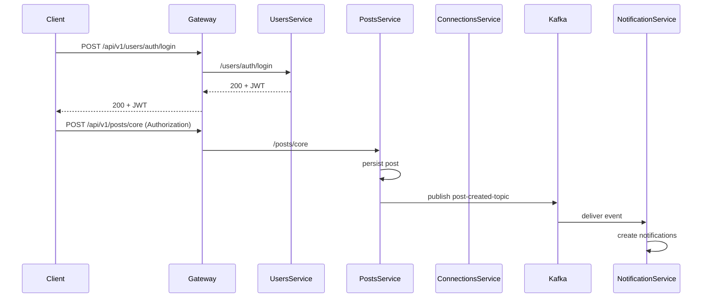

# LinkedIn Clone - Backend Reference

This document focuses on the backend microservices: exposed REST endpoints (via API Gateway and direct), event topics, data shapes, and end-to-end flow diagrams for the complete app.

## 🎯 Purpose

This README is a developer reference for the backend services in this repository. It documents service responsibilities, public API surface (gateway and direct), event flows (Kafka), and common data models so you can understand how the services interact.

## 🏗️ High-level architecture

API Gateway (8080) → Users Service (9010), Posts Service (9020), Connections Service (9030)
Notification Service (9040) consumes Kafka events produced by Posts/Connections/Users. Discovery Server (8761) provides service registry.

Sequence (simplified):
1. Client → API Gateway → Users Service (auth) or other services
2. Users/Posts/Connections publish domain events to Kafka
3. Notification Service consumes topics and writes notifications to DB

## 🔌 Service ports & context paths (direct access)

- Discovery Server: port 8761 (Eureka)
- API Gateway: port 8080, gateway base: `/api/v1`
- Users Service: port 9010, context-path: `/users`
- Posts Service: port 9020, context-path: `/posts`
- Connections Service: port 9030, context-path: `/connections`
- Notification Service: port 9040, context-path: `/notifications`

When services run inside containers they typically expose container port `8080`; docker-compose maps those to host ports (for example host 9010 → container 8080 for `users-service`). When calling through the API Gateway use the gateway base path.

## 🔐 Authentication

- JWT-based authentication.
- Public endpoints: auth endpoints (signup/login) and some health/actuator endpoints.
- All `/core/**` endpoints across services require `Authorization: Bearer <JWT>`.
- The API Gateway enforces JWT validation via a filter before forwarding to downstream services.

## 🌐 Gateway paths (external client-facing)

All client traffic should generally go through the API Gateway at `http://{host}:8080/api/v1`.

- Users: `/api/v1/users/**`
- Posts: `/api/v1/posts/**`
- Connections: `/api/v1/connections/**`
- Notifications: `/api/v1/notifications/**`

Example: register a user (via gateway)

```bash
curl -X POST http://localhost:8080/api/v1/users/auth/signup \
  -H "Content-Type: application/json" \
  -d '{"email":"user@example.com","password":"pass123","name":"John Doe"}'
```

## 📡 Detailed endpoints (by service)

Notes: For each endpoint the examples show the gateway path (preferred) and the direct service URL. All `/core/**` endpoints require JWT authentication via `Authorization: Bearer <token>` header.

1) **Users Service** (authentication, profile)
- `POST /auth/signup` (gateway: `/api/v1/users/auth/signup`, direct: `http://localhost:9010/users/auth/signup`)  
  Payload: { email, password, name }  
  Response: 201 Created with user info (id, email, name, createdAt)  
  Public endpoint (no JWT required)

- `POST /auth/login` (gateway: `/api/v1/users/auth/login`, direct: `http://localhost:9010/users/auth/login`)  
  Payload: { email, password }  
  Response: 200 OK with JWT token string  
  Public endpoint (no JWT required)

- Health and actuator: `GET /users/actuator/health` (direct)

2) **Posts Service** (create, retrieve, like posts)
- `POST /core` (gateway: `/api/v1/posts/core`, direct: `http://localhost:9020/posts/core`)  
  Payload: { content, visibility (PUBLIC | CONNECTIONS), optional: media }  
  Response: 201 Created with PostDto (id, authorId, content, visibility, likeCount, createdAt)  
  Requires JWT. Publishes `post-created-topic` event to Kafka.

- `GET /core/{postId}` (gateway: `/api/v1/posts/core/{postId}`, direct: `http://localhost:9020/posts/core/{postId}`)  
  Response: 200 OK with PostDto  
  Requires JWT.

- `GET /core/users/allPosts` (gateway: `/api/v1/posts/core/users/allPosts`, direct: `http://localhost:9020/posts/core/users/allPosts`)  
  Response: 200 OK with list of PostDto for authenticated user  
  Requires JWT.

- `POST /likes/{postId}/like` (gateway: `/api/v1/posts/likes/{postId}/like`, direct: `http://localhost:9020/posts/likes/{postId}/like`)  
  Response: 204 No Content  
  Requires JWT. Publishes `post-liked-topic` event to Kafka.

- `DELETE /likes/{postId}/unlike` (gateway: `/api/v1/posts/likes/{postId}/unlike`, direct: `http://localhost:9020/posts/likes/{postId}/unlike`)  
  Response: 204 No Content  
  Requires JWT.

3) **Connections Service** (network graph, connection requests)
- `GET /core/first-degree` (gateway: `/api/v1/connections/core/first-degree`, direct: `http://localhost:9030/connections/core/first-degree`)  
  Response: 200 OK with list of PersonDto (direct connections)  
  Requires JWT header with `X-User-Id`.

- `POST /core/request/{userId}` (gateway: `/api/v1/connections/core/request/{userId}`, direct: `http://localhost:9030/connections/core/request/{userId}`)  
  Response: 200 OK with boolean (true if successful)  
  Requires JWT. Publishes `connection-request-sent-topic` event.

- `POST /core/accept/{userId}` (gateway: `/api/v1/connections/core/accept/{userId}`, direct: `http://localhost:9030/connections/core/accept/{userId}`)  
  Response: 200 OK with boolean  
  Requires JWT. Publishes `connection-accepted-topic` event.

- `POST /core/reject/{userId}` (gateway: `/api/v1/connections/core/reject/{userId}`, direct: `http://localhost:9030/connections/core/reject/{userId}`)  
  Response: 200 OK with boolean  
  Requires JWT.

- `GET /core/received-requests` (gateway: `/api/v1/connections/core/received-requests`, direct: `http://localhost:9030/connections/core/received-requests`)  
  Response: 200 OK with list of PersonDto (pending requests received)  
  Requires JWT.

- `GET /core/sent-requests` (gateway: `/api/v1/connections/core/sent-requests`, direct: `http://localhost:9030/connections/core/sent-requests`)  
  Response: 200 OK with list of PersonDto (pending requests sent)  
  Requires JWT.

- `POST /core/remove-connection/{userId}` (gateway: `/api/v1/connections/core/remove-connection/{userId}`, direct: `http://localhost:9030/connections/core/remove-connection/{userId}`)  
  Response: 200 OK with boolean  
  Requires JWT.

- `GET /core/suggested-connections` (gateway: `/api/v1/connections/core/suggested-connections`, direct: `http://localhost:9030/connections/core/suggested-connections`)  
  Response: 200 OK with list of PersonDto (users suggested for connection — excludes the authenticated user, users already connected, and users with pending connection requests to/from the authenticated user)  
  Requires JWT (Authorization: Bearer <token>) and the service expects the authenticated user's id (typically forwarded as `X-User-Id` when calling the service directly).

  Example (via API Gateway):

  ```bash
  curl -X GET "http://localhost:8080/api/v1/connections/core/suggested-connections" \
    -H "Authorization: Bearer <JWT>" \
    -H "Content-Type: application/json"
  ```

4) **Notification Service** (Kafka consumer, event-driven)
- The Notification Service consumes Kafka events and exposes REST endpoints for retrieving notifications.
- Consumes topics: `post-created-topic`, `post-liked-topic`, `connection-request-sent-topic`, `connection-accepted-topic`
- Stores notifications to PostgreSQL as they arrive (Event-Driven Architecture pattern)

- `GET /core/notifications` (gateway: `/api/v1/notifications/core/notifications`, direct: `http://localhost:9040/notifications/core/notifications`)  
  Response: 200 OK with list of NotificationDto (latest 20 notifications for authenticated user, ordered by creation time descending)  
  Requires JWT.

## 🧭 Kafka topics & events

Kafka bootstrap (internal) when running in Docker/Kubernetes: `kafka:29092` (container-internal listener). Docker-compose advertises `localhost:9092` for host tools.

Topics used by services (current):
- `post-created-topic` — Published when a new post is created. Payload: { postId, authorId, content, timestamp }
- `post-liked-topic` — Published when a post is liked. Payload: { postId, likedByUserId, timestamp }
- `connection-request-sent-topic` — Published when a connection request is sent. Payload: { fromUserId, toUserId, timestamp }
- `connection-accepted-topic` — Published when connection accepted. Payload: { fromUserId, toUserId, timestamp }

Notification Service subscribes to all of the above and translates events into Notification rows: { id, userId, type, referenceId, message, read, createdAt }

## 🔁 Typical end-to-end flows

1) New user registers
- Client -> Gateway -> Users Service (signup)
- Users Service creates user row in PostgreSQL
- Users Service publishes `user-created` (or signup) event to Kafka (optional)
- Other services (if any) can consume user-created to warm caches or send welcome notifications

2) Create post → notify connections
- Client (authenticated) -> Gateway -> Posts Service (create post)
- Posts Service persists post to PostgreSQL
- Posts Service publishes `post-created-topic`
- Notification Service consumes `post-created-topic` and creates notifications for the author's connections

3) Connection request → notify recipient
- Client -> Gateway -> Connections Service (send request)
- Connections Service creates a pending relationship in Neo4j (CONNECTION_REQUESTED)
- Connections Service publishes `connection-request-sent-topic` with from/to ids
- Notification Service consumes that topic and creates a notification for the recipient

4) Accept request → notify requester
- Client -> Gateway -> Connections Service (accept)
- Connections Service updates Neo4j relationship to `CONNECTED_TO`
- Connections Service publishes `connection-accepted-topic`
- Notification Service consumes and notifies the requester

## 📦 Data models (core / simplified)

User (users-service / PostgreSQL)
- id: long (UUID or numeric)
- name: string
- email: string
- passwordHash: string
- createdAt: timestamp

Post (posts-service / PostgreSQL)
- id: long
- authorId: long
- content: string
- visibility: enum (PUBLIC, CONNECTIONS)
- createdAt: timestamp

Connection (connections-service / Neo4j)
- Person node: { id, name, email }
- Relationship types: `CONNECTION_REQUESTED`, `CONNECTED_TO`

Notification (notification-service / PostgreSQL)
- id: long
- userId: long (recipient)
- type: enum (POST_CREATED, POST_LIKED, CONNECTION_REQUEST, CONNECTION_ACCEPTED)
- referenceId: long (e.g., postId or userId)
- message: string
- read: boolean
- createdAt: timestamp

## 🔍 Troubleshooting & notes for backend developers

- Kafka connectivity: inside Docker the services connect to `kafka:29092`. If you run Kafka on host, use the advertised external listener `localhost:9092` or adjust `application.yml` bootstrap-servers.
- Neo4j: connections-service expects Bolt port `7687` and credentials `neo4j/password` in the local compose configuration.
- Database migrations: services use `spring.jpa.hibernate.ddl-auto=update` for development; consider external migrations (Flyway/Liquibase) for production.
- Logging: services expose actuator endpoints under their context path; use them for health checks.

## 📈 Flow diagrams

Mermaid sequence diagram (if your viewer supports it):



If Mermaid rendering is not available, here's a simplified ASCII flow for the post-create flow:

Client -> Gateway -> Posts Service (persist) -> Kafka -> Notification Service -> DB

## 🗂️ Appendix: running the system (short)

This doc intentionally focuses on the backend contract and flows. For quick local runtime steps (docker-compose or kubernetes), see the top-level README or each service README (e.g. `backend/users-service/README.md`, `backend/connections-service/README.md`).

---

If you'd like, I can:
- Expand the API reference with full request/response JSON schemas for each endpoint.
- Add OpenAPI / swagger artifacts (or point to existing controller annotations) and include a generated OpenAPI file in `docs/`.
- Extract the Kafka event JSON schemas into separate files under `docs/events/` for easier consumption by downstream services.
