# LinkedIn Clone - Sequence Diagrams

This document contains detailed sequence diagrams for key user flows and system interactions.

## 1. User Registration Flow

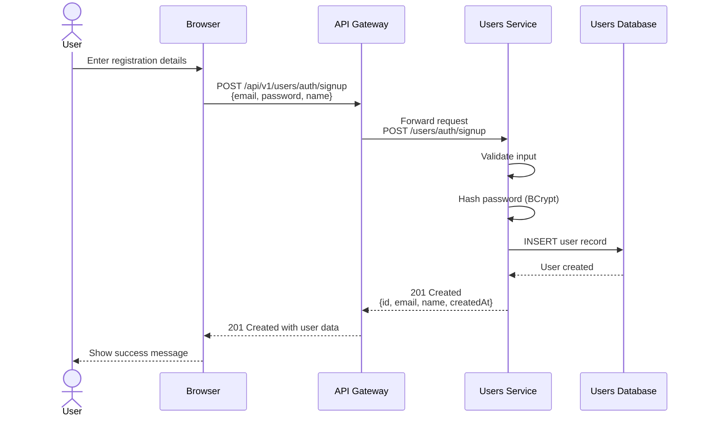

## 2. User Login Flow

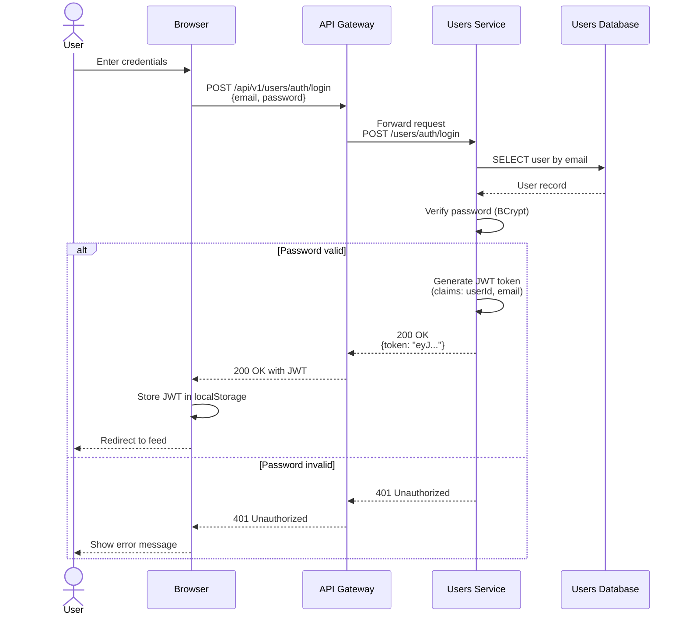

## 3. Create Post Flow (with Event Publishing)

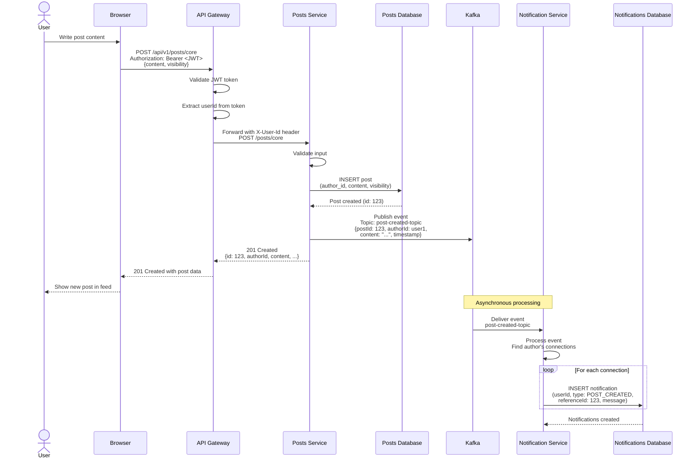

## 4. Like Post Flow

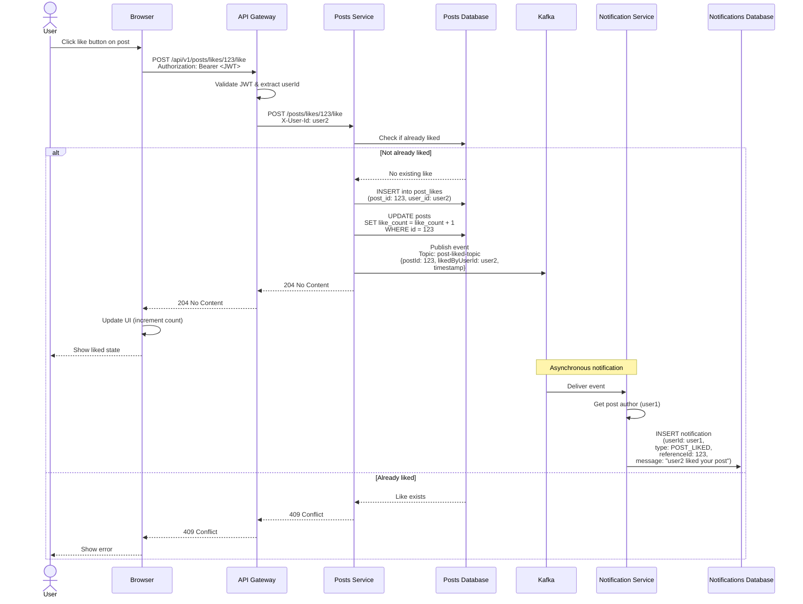

## 5. Send Connection Request Flow

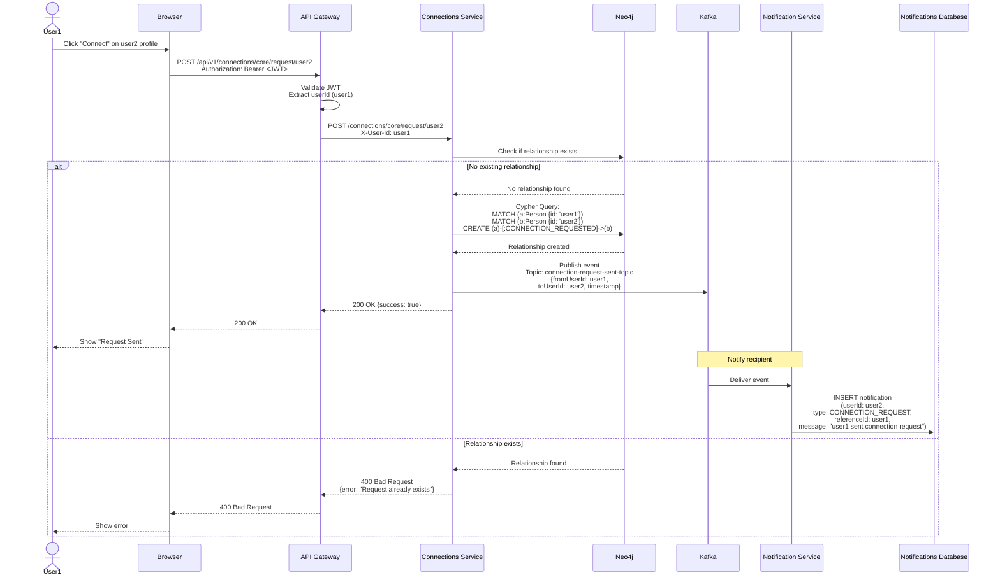

## 6. Accept Connection Request Flow

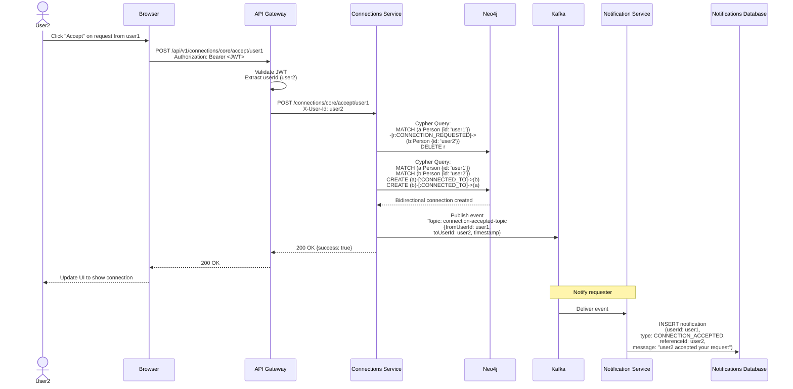

## 7. Get Feed / User's Posts Flow

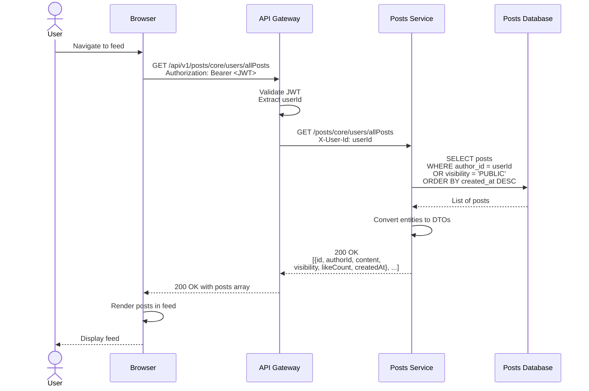

## 8. Get Suggested Connections Flow

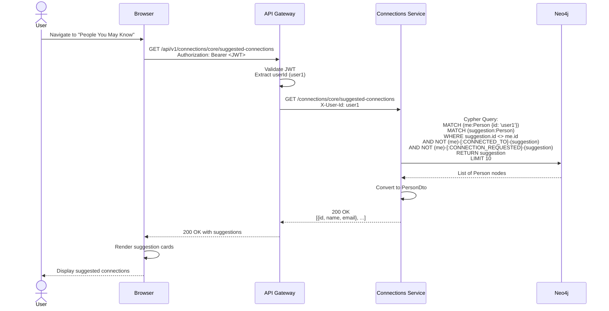

## 9. Get Notifications Flow

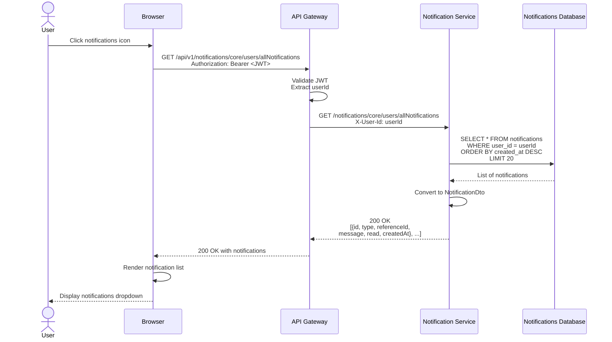

## 10. Service Discovery & Registration Flow

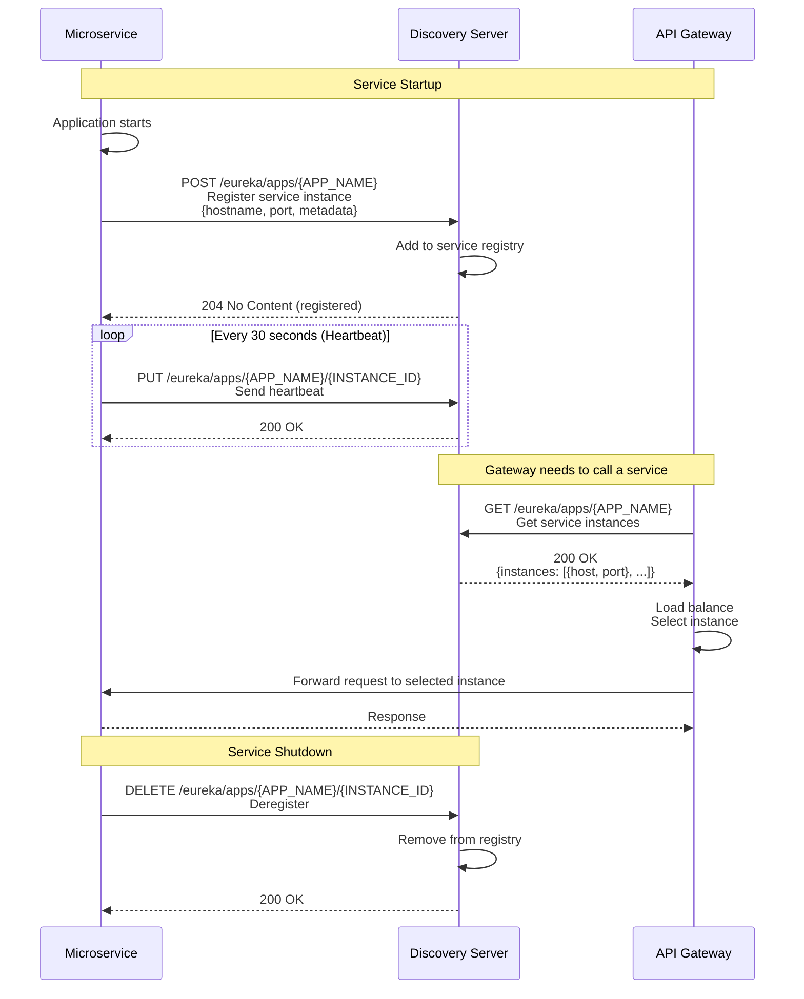

## 11. API Gateway JWT Validation Flow

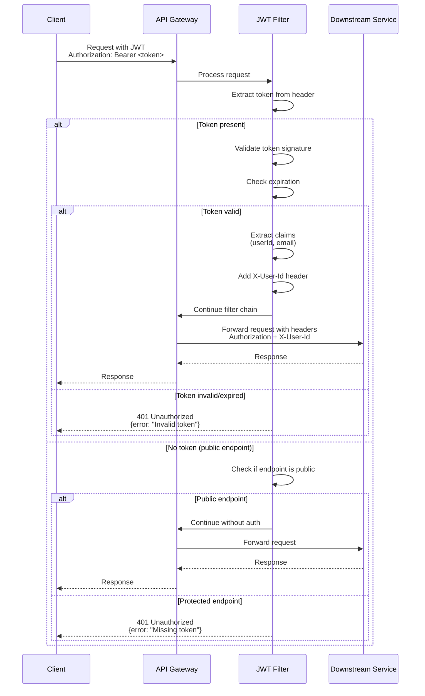

## 12. Error Handling Flow

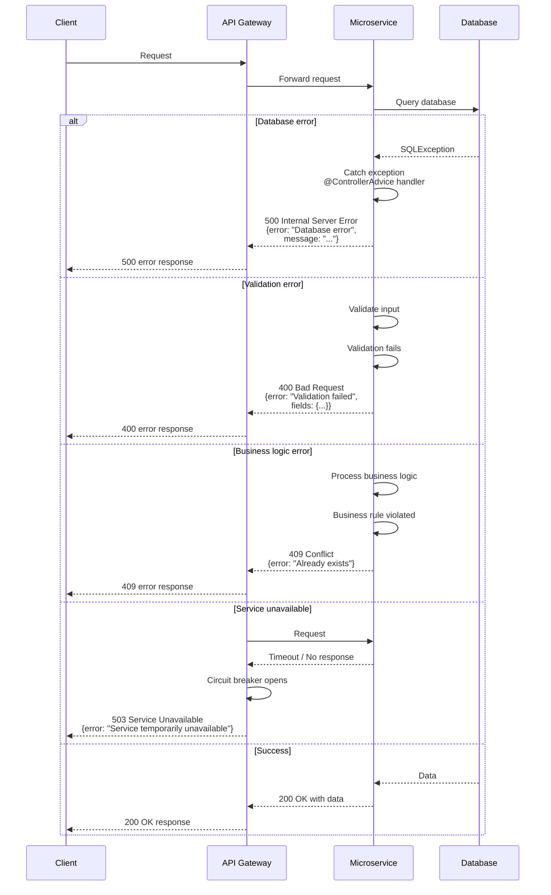

---

**Last Updated**: November 1, 2024
